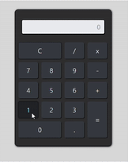

# 🧮 Calculadora Web

Este é um projeto simples de uma **calculadora web**, desenvolvida utilizando **HTML**, **CSS**, **JavaScript** e **Bootstrap** para fins educacionais.
## 📸 Exemplo

---

## ✨ Funcionalidades

Interface moderna com Bootstrap.

Suporte a operações básicas: adição, subtração, multiplicação e divisão.

Botão de limpar (C), ponto decimal (.) e tecla de igual (=).

Responsiva e compatível com diferentes navegadores.

##🛠 Tecnologias Utilizadas
- HTML5
- CSS3
- JavaScript (puro)
- Bootstrap 4
---
## 🗂 Estrutura do Projeto

📁fonte

📁 `css`
  📄 `style.css` # Estilos personalizados da calculadora.
  
📁`js`
  📄 `script.js` # Lógica de funcionamento da calculadora.
  
  📄 `indice.html` # Página principal da aplicação.
  
---
## 📄 Licença
Este projeto está sob a licença MIT. Sinta-se à vontade para usá-lo, modificá-lo e distribuí-lo.

---
## 👨🏻‍💻 Autor
Desenvolvido por [Chris Lucca](https://github.com/LuccaChris)
